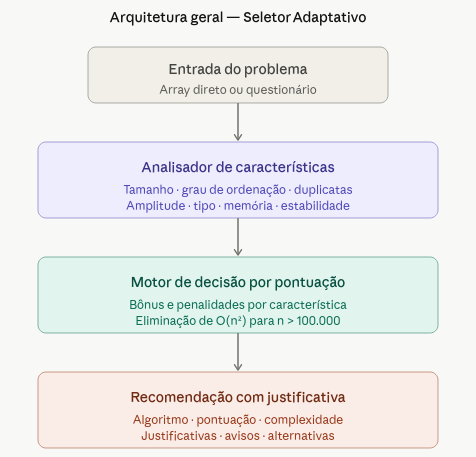

# Seletor Adaptativo de Algoritmos

> Projeto Final — Pesquisa e Ordenação de Dados (POD) 2026.1

## Descrição

O projeto propõe guiar o usuário para a melhor solução de um problema especificado, seu passo a passo consiste em:

1. análise das características de um problema de ordenação ou busca;
2. recomendação automática de algoritmo mais adequado;
3. justificação técnica a decisão tomada;
4. validação empírica a eficiência da recomendação.

O sistema é composto por três camadas principais:



## Integrantes

- Victor Anderson
- Amanda Lira
- João Victor
- Rozane Raquel

## Requisitos

```bash
pip install matplotlib
```

## Como executar

```bash
python main.py
```

## Modos de uso

- **Modo direto** — forneça o array diretamente via código ou arquivo
- **Modo questionário** — responda perguntas sobre o problema

## Estrutura do projeto

```
Projeto-Pesquisa-e-Ordenacao-de-dados/
│
├── algoritmos/
│   ├── pesquisa.py
│   ├── ordenacao.py
│   └── ...
│
├── testes/
│   ├── test_busca.py
│   ├── test_metricas.py
│   ├── test_motor_decisao.py
│   ├── test_ordenacao.py
│   └── test_seletor.py
│
├── teste_benchmark.py
├── requirements.txt
└── README.md
```

## Executando os testes

Para executar todos os testes do projeto:

```bash
python -m unittest discover -s testes -v
```

Resultado esperado:

```
Ran 17 tests

OK
```

---

## Benchmark

O benchmark permite comparar o desempenho dos algoritmos implementados.

Execute:

```bash
python teste_benchmark.py
```

---

## Tecnologias utilizadas

- Python
- Matplotlib
- unittest

---

## Autores

Victor Anderson Bizerra Nicolau

João Victor Vieira do Nascimento

Rozane Raquel da Silva Goncalves

Amanda de Lira Silva